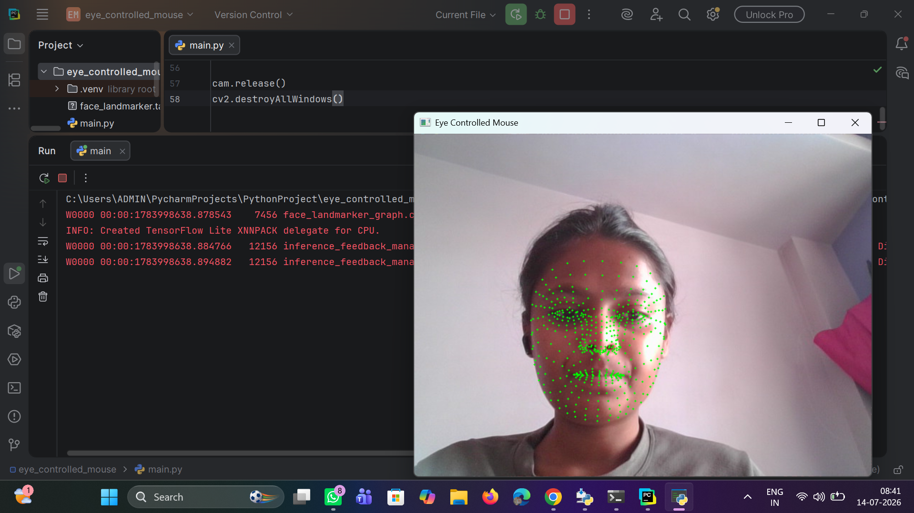

# 👁️ AI Eye-Controlled Mouse using Python, OpenCV & MediaPipe

An AI-powered **Eye-Controlled Mouse** built using **Python**, **OpenCV**, **MediaPipe**, and **PyAutoGUI**.

This project tracks the user's eye movements in real time through a webcam and moves the mouse cursor accordingly. It demonstrates how **Computer Vision** and **Artificial Intelligence** can be used to create hands-free human-computer interaction.

---

## 🚀 Features

- 👁️ Real-time eye tracking
- 🖱️ Mouse cursor control using eye movement
- 😊 Face landmark detection using MediaPipe
- 🎥 Live webcam processing with OpenCV
- ⚡ Fast and lightweight implementation
- 🐍 Beginner-friendly Python project

---

## 🛠️ Technologies Used

- Python 3.11
- OpenCV
- MediaPipe
- PyAutoGUI

---

## 📂 Project Structure

```text
AI-Eye-Controlled-Mouse/
│
├── images/
│   ├── output1.png
│   └── output2.png
│
├── main.py
├── face_landmarker.task
├── requirements.txt
├── .gitignore
└── README.md
```

---

## 📸 Project Output

### Eye Tracking



---

### Mouse Cursor Control


---

## ⚙️ Installation

### 1. Clone the Repository

```bash
git clone https://github.com/anjalikhonde/AI-Eye-Controlled-Mouse.git
```

### 2. Navigate to the Project Folder

```bash
cd AI-Eye-Controlled-Mouse
```

### 3. Create a Virtual Environment

```bash
py -3.11 -m venv .venv
```

### 4. Activate the Virtual Environment

**Windows**

```bash
.venv\Scripts\activate
```

### 5. Install Required Libraries

```bash
pip install -r requirements.txt
```

### 6. Run the Project

```bash
python main.py
```

---

## 🧠 How It Works

1. Opens the webcam using OpenCV.
2. Captures live video frames.
3. Detects facial landmarks using MediaPipe Face Landmarker.
4. Identifies eye landmarks in real time.
5. Maps eye position to screen coordinates.
6. Moves the mouse cursor using PyAutoGUI.
7. Displays the webcam feed with eye tracking.

---

## 📚 What I Learned

This project helped me learn:

- Python Programming
- OpenCV Basics
- Computer Vision
- MediaPipe Face Landmarker
- Facial Landmark Detection
- Eye Tracking
- Mouse Automation with PyAutoGUI
- Real-Time Video Processing
- Git & GitHub

---

## 🚀 Future Improvements

- 👁️ Blink detection for left click
- 🖱️ Right-click using wink detection
- 📜 Scroll using eye movement
- 🎯 Improved cursor smoothing
- ⚙️ Better eye calibration
- 🖥️ Multi-monitor support

---

## 🎯 Applications

- Accessibility tools
- Hands-free computer control
- Human-Computer Interaction (HCI)
- AI & Computer Vision projects
- Educational and research purposes

---

## 🤝 Contributing

Contributions and suggestions are welcome.

If you'd like to improve this project, feel free to fork the repository and submit a pull request.

---

## 👩‍💻 Author

**Anjali Khonde**

Computer Engineering Student

GitHub: https://github.com/anjalikhonde

---

## ⭐ Support

If you found this project useful, please consider giving it a **⭐ Star** on GitHub.

Thank you for visiting this repository!
