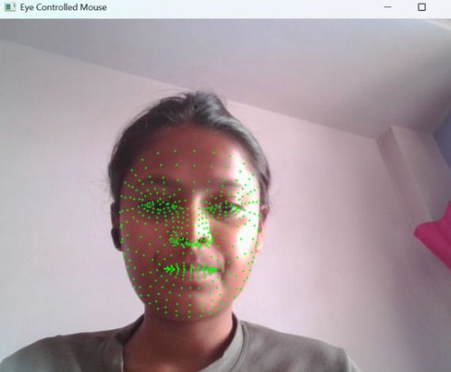

# AI Eye Controlled Mouse

Control your mouse cursor with your eyes using real-time face landmark tracking. Move the cursor with your iris, left-click with a single blink, right-click with a double blink, and scroll by tilting your head.



## Features

- **Cursor movement**: tracked via iris position (MediaPipe FaceLandmarker)
- **Left-click**: single blink
- **Right-click**: double blink (within 0.5s)
- **Scroll**: tilt your head up/down
- **Smoothed motion**: jitter filtering + exponential smoothing for stable control
- **Live status overlay**: FPS, tracking state, blink state

## Tech Stack

- Python 3.11
- [MediaPipe](https://ai.google.dev/edge/mediapipe/solutions/guide): face landmark detection
- OpenCV: webcam capture and preview rendering
- PyAutoGUI: cursor and click control

## Project Structure

```
eye_controlled_mouse/
├── main.py                  # entry point, ties everything together
├── modules/
│   ├── config.py            # all tunable constants
│   ├── camera.py            # webcam open/read helpers
│   ├── face_tracker.py      # MediaPipe model loading + detection
│   ├── cursor_controller.py # iris position -> smoothed cursor movement
│   ├── blink_detector.py    # blink detection -> click / right-click
│   ├── scroll_controller.py # head tilt -> scroll
│   └── ui_overlay.py        # status panel / control box drawing
├── face_landmarker.task     # MediaPipe model file (included in repo)
├── demo.png                 # demo screenshot
└── requirements.txt
```

## Setup

1. Clone the repo and install dependencies:

```
   git clone https://github.com/anjalikhonde/AI-Eye-Controlled-Mouse.git
   cd AI-Eye-Controlled-Mouse
   pip install -r requirements.txt
```

2. The model file `face_landmarker.task` is already included in the repo, so you don't need to download it.

3. Run (a webcam is required):

```
   python main.py
```

4. Press **ESC** to quit.

## Tuning

All thresholds (blink sensitivity, click cooldown, scroll sensitivity, smoothing) live in `modules/config.py`. You don't need to touch the logic files to adjust behavior.

## Notes

This project was built as an accessibility-focused, hands-free mouse control tool. It was improved over several versions to add double-blink right-click, head-scroll, and jitter stabilization.

## License

This project is licensed under the [MIT License](LICENSE).
